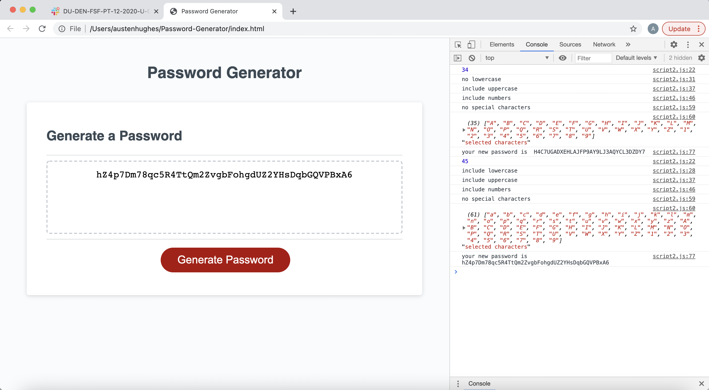

# Password-Generator

Here you find a random password generator. 

This password generator has been built to create a custom password given user selected options. Those options will be presented one at a time with a prompt box. 

The option the user will be given are as follows : 

First : length of password (between 8 and 128 characters)
Second : use of lower case letters?
Third : use of uppercase letters?
Fourth : use of numbers?
Last : use of special characters? 

The program will then verify you have selected at least one option for character type (presented in questions 2-5) if at least one has been selected : password will appear in password box.

The password box will let you copy the new password to take with you but you can not write in this box/ accidentally delete the password that has been produced … this is on purpose. 

If you would like a different password hit the button and you will start the question over and get a new password just like before.

All steps console log information as you go. Here you can find previously generated passwords/info about what kind of characters you have selected for each password that had been generated. 

link : https://austenhughes.github.io/Password-Generator/

